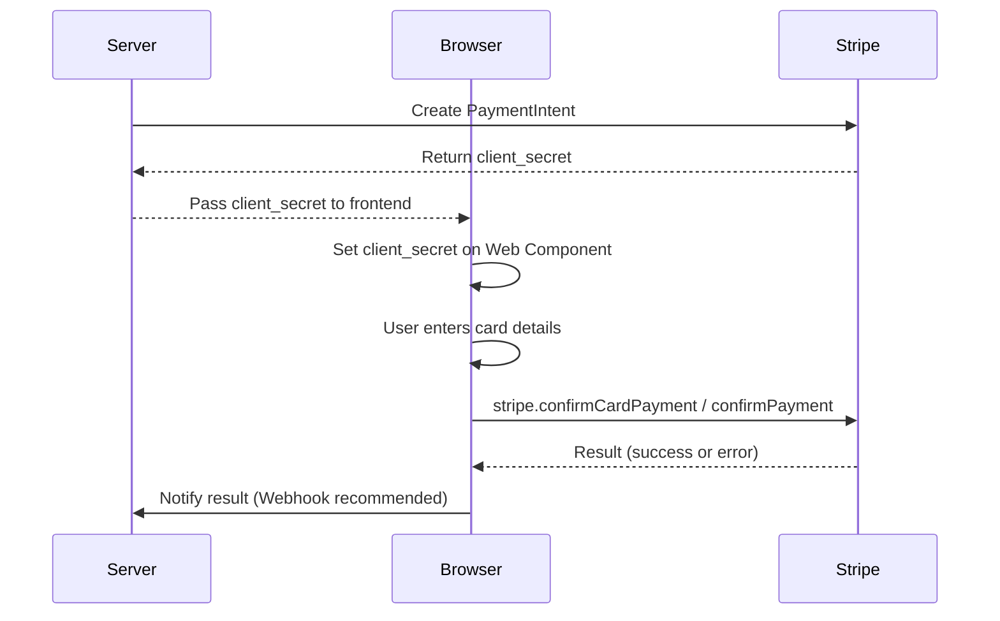
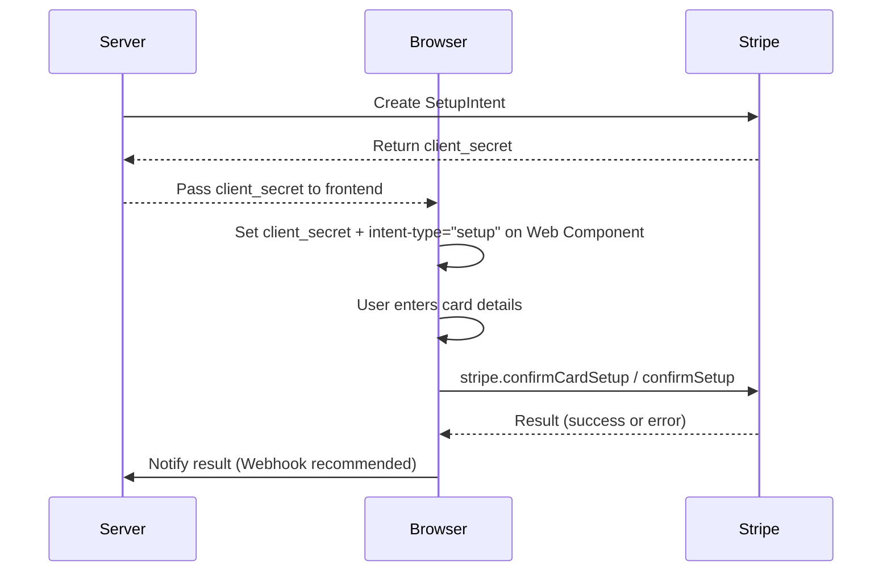
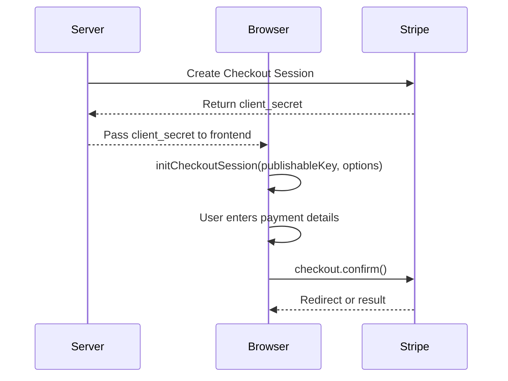
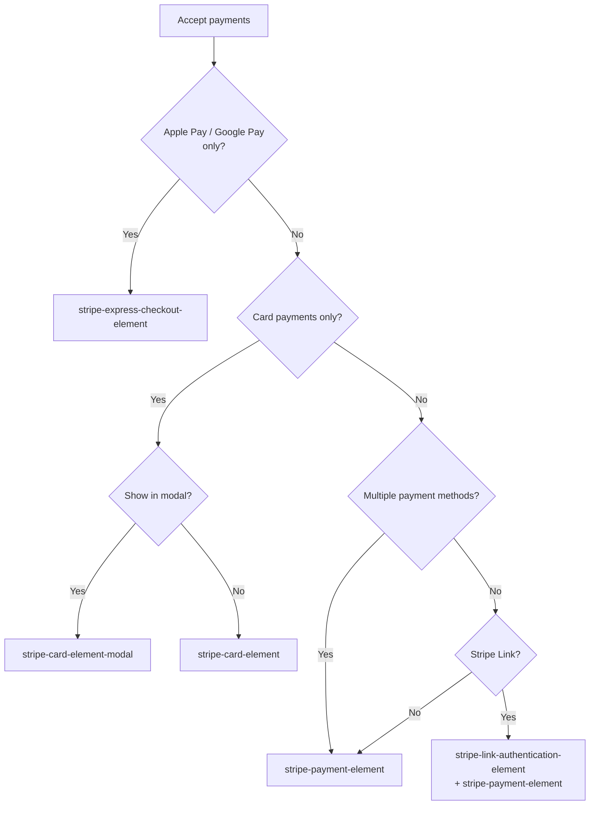

This guide explains the main payment flows used with stripe-pwa-elements.

## PaymentIntent Flow

Use this for immediate payments. Works with `<stripe-card-element>` or `<stripe-payment-element>`.



### Code Example

```html
<stripe-payment-element
  publishable-key="pk_test_xxxxx"
  intent-client-secret="pi_xxxxx_secret_xxxxx"
></stripe-payment-element>
```

```js
const el = document.querySelector('stripe-payment-element');
el.addEventListener('defaultFormSubmitResult', ({ detail }) => {
  if (detail instanceof Error) {
    console.error(detail);
  } else {
    console.log('Success:', detail);
  }
});
```

## SetupIntent Flow

Use this to save card details for future payments. Set `intent-type="setup"`.



### Code Example

```html
<stripe-card-element
  publishable-key="pk_test_xxxxx"
  intent-client-secret="seti_xxxxx_secret_xxxxx"
  intent-type="setup"
></stripe-card-element>
```

## Checkout Session Flow

An integrated payment flow using Stripe Checkout. Use `<stripe-payment-element>` with the `initCheckoutSession` method.



### Code Example

```js
const el = document.querySelector('stripe-payment-element');
await customElements.whenDefined('stripe-payment-element');
await el.initCheckoutSession('pk_test_xxxxx', {
  checkoutSessionClientSecret: 'cs_xxxxx_secret_xxxxx',
});
```

## Component Selection Guide

Choose the right component for your use case.



| Component | Use Case |
| --- | --- |
| `stripe-card-element` | Card-only payments (separate card number, expiry, CVC fields) |
| `stripe-card-element-modal` | Card payments in a modal |
| `stripe-payment-element` | Multiple payment methods in a unified form (cards, bank transfers, wallets, etc.) |
| `stripe-express-checkout-element` | One-click payments with Apple Pay / Google Pay / Link |
| `stripe-link-authentication-element` | Email authentication with Stripe Link |
| `stripe-address-element` | Address collection |
| `stripe-currency-selector` | Currency selection for Adaptive Pricing |

## Next

- See [Components](/en/components/) for detailed API reference
- See [Getting Started](/en/guides/getting-started/) for basic setup
