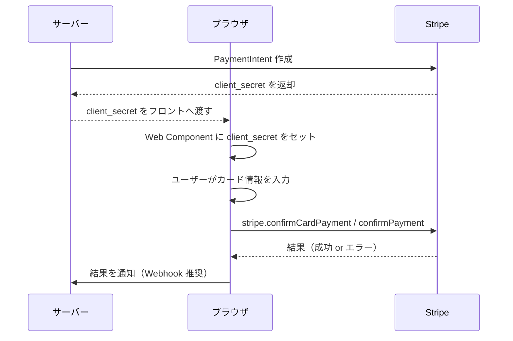
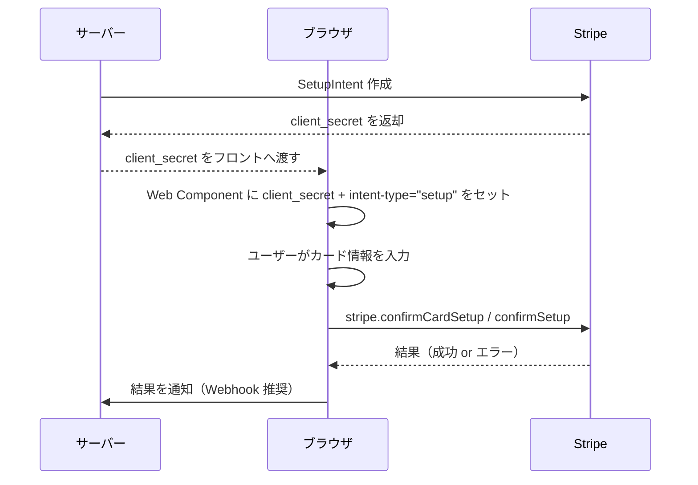
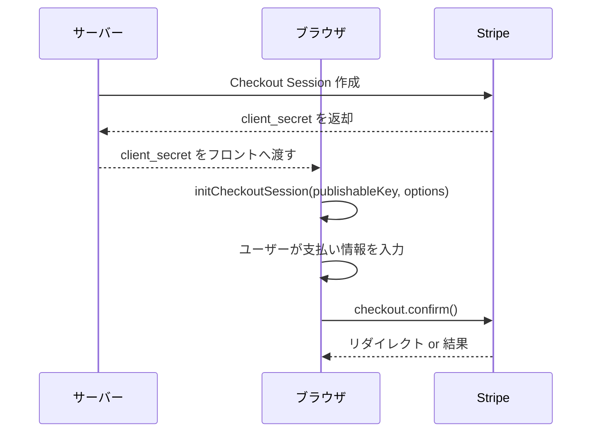
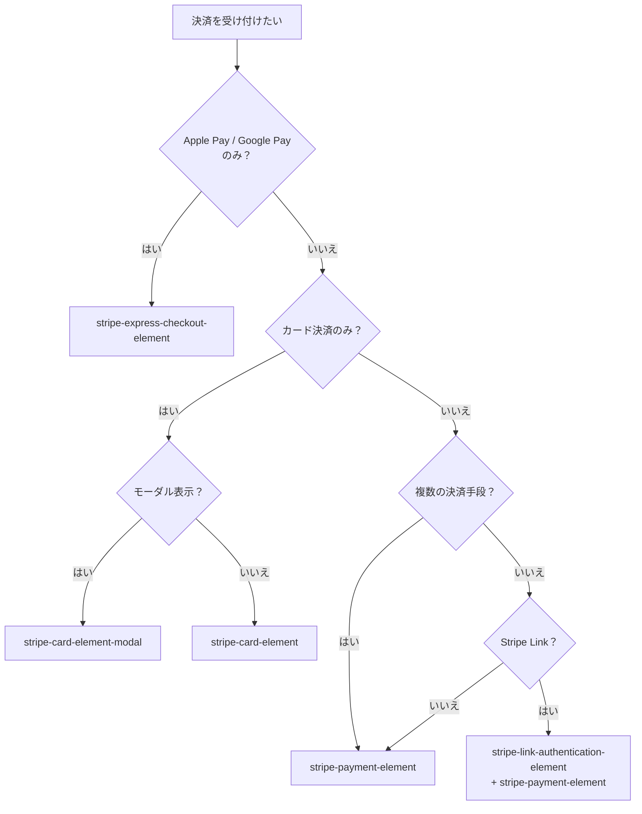

このガイドでは、stripe-pwa-elements で使用する主要な決済フローを説明します。

## PaymentIntent フロー

即時決済を行う場合に使用します。`<stripe-card-element>` または `<stripe-payment-element>` で利用できます。



### コード例

```html
<stripe-payment-element
  publishable-key="pk_test_xxxxx"
  intent-client-secret="pi_xxxxx_secret_xxxxx"
></stripe-payment-element>
```

```js
const el = document.querySelector('stripe-payment-element');
el.addEventListener('defaultFormSubmitResult', ({ detail }) => {
  if (detail instanceof Error) {
    console.error(detail);
  } else {
    console.log('Success:', detail);
  }
});
```

## SetupIntent フロー

将来の決済のためにカード情報を保存する場合に使用します。`intent-type="setup"` を指定します。



### コード例

```html
<stripe-card-element
  publishable-key="pk_test_xxxxx"
  intent-client-secret="seti_xxxxx_secret_xxxxx"
  intent-type="setup"
></stripe-card-element>
```

## Checkout Session フロー

Stripe Checkout を使用した統合型の決済フローです。`<stripe-payment-element>` で `initCheckoutSession` メソッドを使用します。



### コード例

```js
const el = document.querySelector('stripe-payment-element');
await customElements.whenDefined('stripe-payment-element');
await el.initCheckoutSession('pk_test_xxxxx', {
  checkoutSessionClientSecret: 'cs_xxxxx_secret_xxxxx',
});
```

## コンポーネント選択ガイド

用途に応じて最適なコンポーネントを選択してください。



| コンポーネント | ユースケース |
| --- | --- |
| `stripe-card-element` | カード決済のみ（カード番号・有効期限・CVC を個別表示） |
| `stripe-card-element-modal` | カード決済をモーダルで表示 |
| `stripe-payment-element` | 複数の決済手段を統合表示（カード・銀行振込・ウォレットなど） |
| `stripe-express-checkout-element` | Apple Pay / Google Pay / Link のワンクリック決済 |
| `stripe-link-authentication-element` | Stripe Link によるメール認証 |
| `stripe-address-element` | 住所の収集 |
| `stripe-currency-selector` | Adaptive Pricing の通貨選択 |

## 次に読む

- 各コンポーネントの詳細は [Components](/components/) を参照
- 基本的なセットアップは [Getting Started](/guides/getting-started/) を参照
