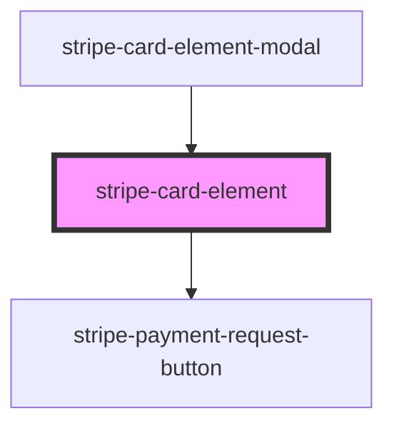

# stripe-payment-sheet

<!-- Auto Generated Below -->

## Properties

| Property                           | Attribute                               | Description                                                                                                                                                                                                                                                | Type                                                      | Default                          |
| ---------------------------------- | --------------------------------------- | ---------------------------------------------------------------------------------------------------------------------------------------------------------------------------------------------------------------------------------------------------------- | --------------------------------------------------------- | -------------------------------- |
| `applicationName`                  | `application-name`                      | Overwrite the application name that registered For wrapper library (like Capacitor)                                                                                                                                                                        | `string`                                                  | `'stripe-pwa-elements'`          |
| `buttonLabel`                      | `button-label`                          | Submit button label By default we recommended to use these string - 'Pay' -> PaymentSheet - 'Add' -> PaymentFlow(Android) - 'Add card' -> PaymentFlow(iOS) - 'Add a card' -> PaymentFlow(iOS) These strings will translated automatically by this library. | `string`                                                  | `'Pay'`                          |
| `handleSubmit`                     | `handle-submit`                         | Form submit event handler                                                                                                                                                                                                                                  | `(event: Event, props: FormSubmitEvent) => Promise<void>` | `undefined`                      |
| `intentClientSecret`               | `intent-client-secret`                  | The client secret from paymentIntent.create response                                                                                                                                                                                                       | `string`                                                  | `undefined`                      |
| `intentType`                       | `intent-type`                           | Default submit handle type. If you want to use `setupIntent`, should update this attribute.                                                                                                                                                                | `"payment" \| "setup"`                                    | `'payment'`                      |
| `publishableKey`                   | `publishable-key`                       | Your Stripe publishable API key.                                                                                                                                                                                                                           | `string`                                                  | `undefined`                      |
| `sheetTitle`                       | `sheet-title`                           | Payment sheet title By default we recommended to use these string - 'Add your payment information' -> PaymentSheet / PaymentFlow(Android) - 'Add a card' -> PaymentFlow(iOS) These strings will translated automatically by this library.                  | `string`                                                  | `'Add your payment information'` |
| `shouldUseDefaultFormSubmitAction` | `should-use-default-form-submit-action` | The component will provide a function to call the `stripe.confirmCardPayment`API. If you want to customize the behavior, should set false. And listen the 'formSubmit' event on the element                                                                | `boolean`                                                 | `true`                           |
| `showLabel`                        | `show-label`                            | Show the form label                                                                                                                                                                                                                                        | `boolean`                                                 | `false`                          |
| `showPaymentRequestButton`         | `show-payment-request-button`           | If show PaymentRequest Button, should put true                                                                                                                                                                                                             | `boolean`                                                 | `undefined`                      |
| `stripeAccount`                    | `stripe-account`                        | Optional. Making API calls for connected accounts                                                                                                                                                                                                          | `string`                                                  | `undefined`                      |
| `stripeDidLoaded`                  | `stripe-did-loaded`                     | Stripe.js class loaded handler                                                                                                                                                                                                                             | `(event: StripeLoadedEvent) => Promise<void>`             | `undefined`                      |
| `zip`                              | `zip`                                   | If true, show zip code field                                                                                                                                                                                                                               | `boolean`                                                 | `true`                           |

## Events

| Event                     | Description                                   | Type                                                                                                                                                                                                                                       |
| ------------------------- | --------------------------------------------- | ------------------------------------------------------------------------------------------------------------------------------------------------------------------------------------------------------------------------------------------ |
| `defaultFormSubmitResult` | Recieve the result of defaultFormSubmit event | `CustomEvent<Error \| { paymentIntent: PaymentIntent; error?: undefined; } \| { paymentIntent?: undefined; error: StripeError; } \| { setupIntent: SetupIntent; error?: undefined; } \| { setupIntent?: undefined; error: StripeError; }>` |
| `formSubmit`              | Form submit event                             | `CustomEvent<{ stripe: Stripe; cardNumberElement: StripeCardNumberElement; cardExpiryElement: StripeCardExpiryElement; cardCVCElement: StripeCardCvcElement; intentClientSecret?: string; zipCode?: string; }>`                            |
| `stripeLoaded`            | Stripe Client loaded event                    | `CustomEvent<{ stripe: Stripe; }>`                                                                                                                                                                                                         |

## Methods

### `initStripe(publishableKey: string, options?: InitStripeOptions) => Promise<void>`

Get Stripe.js, and initialize elements

#### Parameters

| Name             | Type                          | Description |
| ---------------- | ----------------------------- | ----------- |
| `publishableKey` | `string`                      |             |
| `options`        | `{ stripeAccount?: string; }` |             |

#### Returns

Type: `Promise<void>`

### `setErrorMessage(errorMessage: string) => Promise<this>`

Set error message

#### Parameters

| Name           | Type     | Description |
| -------------- | -------- | ----------- |
| `errorMessage` | `string` | string      |

#### Returns

Type: `Promise<this>`

### `setPaymentRequestOption(option: PaymentRequestButtonOption) => Promise<this>`

#### Parameters

| Name     | Type                                                                                                                                                                                                                                                                                      | Description |
| -------- | ----------------------------------------------------------------------------------------------------------------------------------------------------------------------------------------------------------------------------------------------------------------------------------------- | ----------- |
| `option` | `PaymentRequestOptions & { paymentRequestPaymentMethodHandler?: PaymentRequestPaymentMethodEventHandler; paymentRequestShippingAddressChangeHandler?: PaymentRequestShippingAddressEventHandler; paymentRequestShippingOptionChangeHandler?: PaymentRequestShippingOptionEventHandler; }` |             |

#### Returns

Type: `Promise<this>`

### `updateProgress(progress: ProgressStatus) => Promise<this>`

Update the form submit progress

#### Parameters

| Name       | Type                                        | Description |
| ---------- | ------------------------------------------- | ----------- |
| `progress` | `"" \| "loading" \| "success" \| "failure"` |             |

#### Returns

Type: `Promise<this>`

## Dependencies

### Used by

 - [stripe-card-element-modal](../stripe-card-element-modal)

### Depends on

- [stripe-payment-request-button](../stripe-payment-request-button)

### Graph

----------------------------------------------

*Built with [StencilJS](https://stenciljs.com/)*
