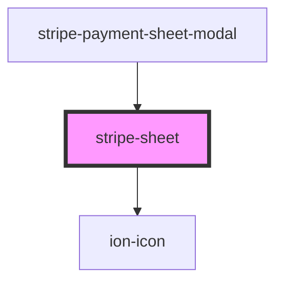

# stripe-element-modal

<!-- Auto Generated Below -->

## Properties

| Property          | Attribute           | Description                               | Type      | Default |
| ----------------- | ------------------- | ----------------------------------------- | --------- | ------- |
| `open`            | `open`              | Modal state. If true, the modal will open | `boolean` | `false` |
| `showCloseButton` | `show-close-button` | If true, the modal display close button   | `boolean` | `true`  |

## Events

| Event   | Description | Type               |
| ------- | ----------- | ------------------ |
| `close` |             | `CustomEvent<any>` |

## Methods

### `closeModal() => Promise<void>`

Close the modal

#### Returns

Type: `Promise<void>`

### `openModal() => Promise<void>`

Open the modal

#### Returns

Type: `Promise<void>`

### `toggleModal() => Promise<void>`

Toggle modal state

#### Returns

Type: `Promise<void>`

## Dependencies

### Used by

 - [stripe-payment-sheet-modal](../stripe-payment-sheet-modal)

### Depends on

- ion-icon

### Graph

----------------------------------------------

*Built with [StencilJS](https://stenciljs.com/)*
