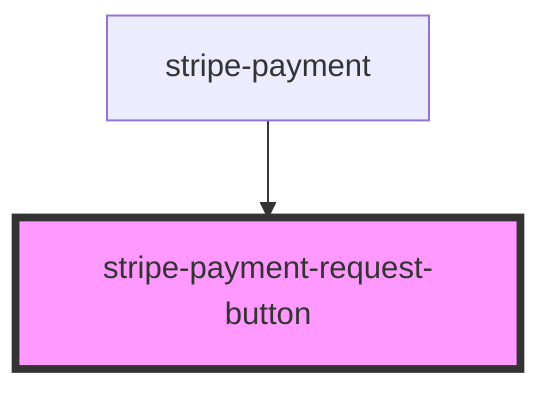

# stripe-payment-request-button

<!-- Auto Generated Below -->

## Properties

| Property                      | Attribute         | Description                                                           | Type                                                                           | Default     |
| ----------------------------- | ----------------- | --------------------------------------------------------------------- | ------------------------------------------------------------------------------ | ----------- |
| `paymentMethodEventHandler`   | --                | Set handler of the `paymentRequest.on('paymentmethod'` event.         | `(event: PaymentRequestPaymentMethodEvent, stripe: Stripe) => Promise<void>`   | `undefined` |
| `publishableKey`              | `publishable-key` | Your Stripe publishable API key.                                      | `string`                                                                       | `undefined` |
| `shippingAddressEventHandler` | --                | Set handler of the `paymentRequest.on('shippingaddresschange')` event | `(event: PaymentRequestShippingAddressEvent, stripe: Stripe) => Promise<void>` | `undefined` |
| `shippingOptionEventHandler`  | --                | Set handler of the `paymentRequest.on('shippingoptionchange')` event  | `(event: PaymentRequestShippingOptionEvent, stripe: Stripe) => Promise<void>`  | `undefined` |
| `stripeDidLoaded`             | --                | Stripe.js class loaded handler                                        | `(event: StripeLoadedEvent) => Promise<void>`                                  | `undefined` |

## Events

| Event          | Description                | Type                               |
| -------------- | -------------------------- | ---------------------------------- |
| `stripeLoaded` | Stripe Client loaded event | `CustomEvent<{ stripe: Stripe; }>` |

## Methods

### `initStripe(publishableKey: string) => Promise<void>`

Get Stripe.js, and initialize elements

#### Returns

Type: `Promise<void>`

### `setPaymentMethodEventHandler(handler: PaymentRequestPaymentMethodEventHandler) => Promise<void>`

Register event handler for `paymentRequest.on('paymentmethod'` event.

#### Returns

Type: `Promise<void>`

### `setPaymentRequestOption(option: PaymentRequestOptions) => Promise<this>`

#### Returns

Type: `Promise<this>`

### `setPaymentRequestShippingAddressEventHandler(handler: PaymentRequestShippingAddressEventHandler) => Promise<void>`

Register event handler for `paymentRequest.on('shippingaddresschange'` event.

#### Returns

Type: `Promise<void>`

### `setPaymentRequestShippingOptionEventHandler(handler: PaymentRequestShippingOptionEventHandler) => Promise<void>`

Register event handler for `paymentRequest.on('shippingoptionchange'` event.

#### Returns

Type: `Promise<void>`

## Dependencies

### Used by

- [stripe-payment](../stripe-payment-sheet)

### Graph

---

_Built with [StencilJS](https://stenciljs.com/)_
