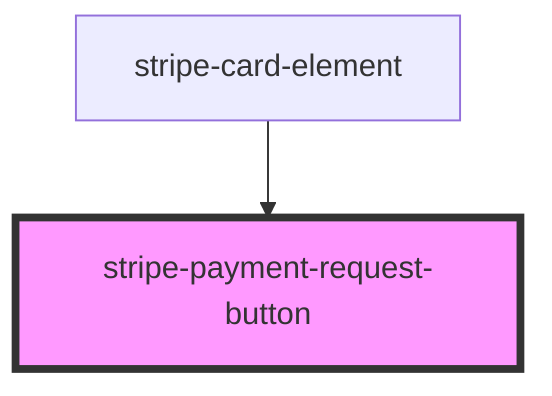

# stripe-payment-request-button

<!-- Auto Generated Below -->

## Properties

| Property                      | Attribute                        | Description                                                                         | Type                                                                           | Default                 |
| ----------------------------- | -------------------------------- | ----------------------------------------------------------------------------------- | ------------------------------------------------------------------------------ | ----------------------- |
| `applicationName`             | `application-name`               | Overwrite the application name that registered For wrapper library (like Capacitor) | `string`                                                                       | `'stripe-pwa-elements'` |
| `paymentMethodEventHandler`   | `payment-method-event-handler`   | Set handler of the `paymentRequest.on('paymentmethod'` event.                       | `(event: PaymentRequestPaymentMethodEvent, stripe: Stripe) => Promise<void>`   | `undefined`             |
| `publishableKey`              | `publishable-key`                | Your Stripe publishable API key.                                                    | `string`                                                                       | `undefined`             |
| `shippingAddressEventHandler` | `shipping-address-event-handler` | Set handler of the `paymentRequest.on('shippingaddresschange')` event               | `(event: PaymentRequestShippingAddressEvent, stripe: Stripe) => Promise<void>` | `undefined`             |
| `shippingOptionEventHandler`  | `shipping-option-event-handler`  | Set handler of the `paymentRequest.on('shippingoptionchange')` event                | `(event: PaymentRequestShippingOptionEvent, stripe: Stripe) => Promise<void>`  | `undefined`             |
| `stripeAccount`               | `stripe-account`                 | Optional. Making API calls for connected accounts                                   | `string`                                                                       | `undefined`             |
| `stripeDidLoaded`             | `stripe-did-loaded`              | Stripe.js class loaded handler                                                      | `(event: StripeLoadedEvent) => Promise<void>`                                  | `undefined`             |

## Events

| Event          | Description                | Type                               |
| -------------- | -------------------------- | ---------------------------------- |
| `stripeLoaded` | Stripe Client loaded event | `CustomEvent<{ stripe: Stripe; }>` |

## Methods

### `initStripe(publishableKey: string, options?: { showButton?: boolean; stripeAccount?: string; }) => Promise<void>`

Get Stripe.js, and initialize elements

#### Parameters

| Name             | Type                                                | Description |
| ---------------- | --------------------------------------------------- | ----------- |
| `publishableKey` | `string`                                            |             |
| `options`        | `{ showButton?: boolean; stripeAccount?: string; }` |             |

#### Returns

Type: `Promise<void>`

### `isAvailable(type: "applePay" | "googlePay") => Promise<void>`

Check isAvailable ApplePay or GooglePay.
If you run this method, you should run before initStripe.

#### Parameters

| Name   | Type                        | Description |
| ------ | --------------------------- | ----------- |
| `type` | `"applePay" \| "googlePay"` |             |

#### Returns

Type: `Promise<void>`

### `setPaymentMethodEventHandler(handler: PaymentRequestPaymentMethodEventHandler) => Promise<void>`

Register event handler for `paymentRequest.on('paymentmethod'` event.

#### Parameters

| Name      | Type                                                                         | Description |
| --------- | ---------------------------------------------------------------------------- | ----------- |
| `handler` | `(event: PaymentRequestPaymentMethodEvent, stripe: Stripe) => Promise<void>` |             |

#### Returns

Type: `Promise<void>`

### `setPaymentRequestOption(option: PaymentRequestOptions) => Promise<this>`

#### Parameters

| Name     | Type                    | Description |
| -------- | ----------------------- | ----------- |
| `option` | `PaymentRequestOptions` |             |

#### Returns

Type: `Promise<this>`

### `setPaymentRequestShippingAddressEventHandler(handler: PaymentRequestShippingAddressEventHandler) => Promise<void>`

Register event handler for `paymentRequest.on('shippingaddresschange'` event.

#### Parameters

| Name      | Type                                                                           | Description |
| --------- | ------------------------------------------------------------------------------ | ----------- |
| `handler` | `(event: PaymentRequestShippingAddressEvent, stripe: Stripe) => Promise<void>` |             |

#### Returns

Type: `Promise<void>`

### `setPaymentRequestShippingOptionEventHandler(handler: PaymentRequestShippingOptionEventHandler) => Promise<void>`

Register event handler for `paymentRequest.on('shippingoptionchange'` event.

#### Parameters

| Name      | Type                                                                          | Description |
| --------- | ----------------------------------------------------------------------------- | ----------- |
| `handler` | `(event: PaymentRequestShippingOptionEvent, stripe: Stripe) => Promise<void>` |             |

#### Returns

Type: `Promise<void>`

## Dependencies

### Used by

 - [stripe-card-element](../stripe-card-element)

### Graph

----------------------------------------------

*Built with [StencilJS](https://stenciljs.com/)*
