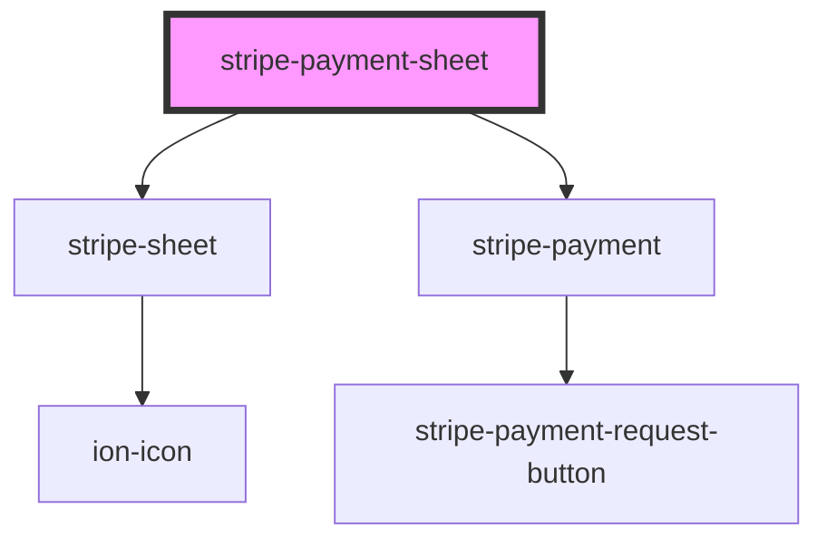

# stripe-payment-sheet-modal

<!-- Auto Generated Below -->

## Properties

| Property                           | Attribute                               | Description                                                                                                                                                                                                                                                | Type                                                      | Default     |
| ---------------------------------- | --------------------------------------- | ---------------------------------------------------------------------------------------------------------------------------------------------------------------------------------------------------------------------------------------------------------- | --------------------------------------------------------- | ----------- |
| `applicationName`                  | `application-name`                      | Overwrite the application name that registered For wrapper library (like Capacitor)                                                                                                                                                                        | `string`                                                  | `undefined` |
| `buttonLabel`                      | `button-label`                          | Submit button label By default we recommended to use these string - 'Pay' -> PaymentSheet - 'Add' -> PaymentFlow(Android) - 'Add card' -> PaymentFlow(iOS) - 'Add a card' -> PaymentFlow(iOS) These strings will translated automatically by this library. | `string`                                                  | `undefined` |
| `handleSubmit`                     | --                                      | Form submit event handler                                                                                                                                                                                                                                  | `(event: Event, props: FormSubmitEvent) => Promise<void>` | `undefined` |
| `intentClientSecret`               | `intent-client-secret`                  | The client secret from paymentIntent.create response                                                                                                                                                                                                       | `string`                                                  | `undefined` |
| `intentType`                       | `intent-type`                           | Default submit handle type. If you want to use `setupIntent`, should update this attribute.                                                                                                                                                                | `"payment" \| "setup"`                                    | `'payment'` |
| `open`                             | `open`                                  | Modal state. If true, the modal will open                                                                                                                                                                                                                  | `boolean`                                                 | `false`     |
| `publishableKey`                   | `publishable-key`                       | Your Stripe publishable API key.                                                                                                                                                                                                                           | `string`                                                  | `undefined` |
| `sheetTitle`                       | `sheet-title`                           | Payment sheet title By default we recommended to use these string - 'Add your payment information' -> PaymentSheet / PaymentFlow(Android) - 'Add a card' -> PaymentFlow(iOS) These strings will translated automatically by this library.                  | `string`                                                  | `undefined` |
| `shouldUseDefaultFormSubmitAction` | `should-use-default-form-submit-action` | The component will provide a function to call the `stripe.confirmCardPayment`API. If you want to customize the behavior, should set false. And listen the 'formSubmit' event on the element                                                                | `boolean`                                                 | `true`      |
| `showCloseButton`                  | `show-close-button`                     | If true, the modal display close button                                                                                                                                                                                                                    | `boolean`                                                 | `true`      |
| `showLabel`                        | `show-label`                            | Show the form label                                                                                                                                                                                                                                        | `boolean`                                                 | `false`     |
| `stripeAccount`                    | `stripe-account`                        | Optional. Making API calls for connected accounts                                                                                                                                                                                                          | `string`                                                  | `undefined` |
| `stripeDidLoaded`                  | --                                      | Stripe.js class loaded handler                                                                                                                                                                                                                             | `(event: StripeLoadedEvent) => Promise<void>`             | `undefined` |
| `zip`                              | `zip`                                   | If true, show zip code field                                                                                                                                                                                                                               | `boolean`                                                 | `true`      |

## Events

| Event    | Description | Type               |
| -------- | ----------- | ------------------ |
| `closed` |             | `CustomEvent<any>` |

## Methods

### `destroy() => Promise<void>`

Remove the modal

#### Returns

Type: `Promise<void>`

### `getStripePaymentSheetElement() => Promise<HTMLStripePaymentElement>`

Get the inner component

#### Returns

Type: `Promise<HTMLStripePaymentElement>`

### `present() => Promise<unknown>`

open modal

#### Returns

Type: `Promise<unknown>`

### `setPaymentRequestButton(options: PaymentRequestButtonOption) => Promise<void>`

Add payment request button

#### Parameters

| Name      | Type                                                                                                                                                                                                                                                                                      | Description |
| --------- | ----------------------------------------------------------------------------------------------------------------------------------------------------------------------------------------------------------------------------------------------------------------------------------------- | ----------- |
| `options` | `PaymentRequestOptions & { paymentRequestPaymentMethodHandler?: PaymentRequestPaymentMethodEventHandler; paymentRequestShippingAddressChangeHandler?: PaymentRequestShippingAddressEventHandler; paymentRequestShippingOptionChangeHandler?: PaymentRequestShippingOptionEventHandler; }` |             |

#### Returns

Type: `Promise<void>`

### `updateProgress(progress: ProgressStatus) => Promise<HTMLStripePaymentElement>`

Update Stripe client loading process

#### Parameters

| Name       | Type                                        | Description |
| ---------- | ------------------------------------------- | ----------- |
| `progress` | `"" \| "loading" \| "success" \| "failure"` |             |

#### Returns

Type: `Promise<HTMLStripePaymentElement>`

## Dependencies

### Depends on

- [stripe-sheet](../stripe-element-modal)
- [stripe-payment](../stripe-payment-sheet)

### Graph

----------------------------------------------

*Built with [StencilJS](https://stenciljs.com/)*
