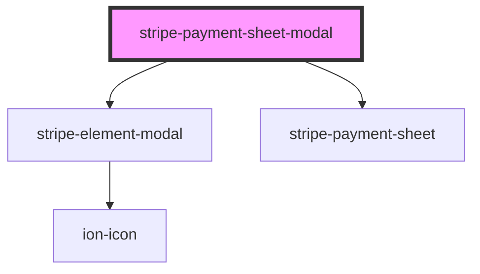

# stripe-payment-sheet-modal

<!-- Auto Generated Below -->

## Properties

| Property                           | Attribute                               | Description                                                                                                                                                                                 | Type                                                      | Default     |
| ---------------------------------- | --------------------------------------- | ------------------------------------------------------------------------------------------------------------------------------------------------------------------------------------------- | --------------------------------------------------------- | ----------- |
| `handleSubmit`                     | --                                      | Form submit event handler                                                                                                                                                                   | `(event: Event, props: FormSubmitEvent) => Promise<void>` | `undefined` |
| `open`                             | `open`                                  | Modal state. If true, the modal will open                                                                                                                                                   | `boolean`                                                 | `false`     |
| `paymentIntentClientSecret`        | `payment-intent-client-secret`          | The client secret from paymentIntent.create response                                                                                                                                        | `string`                                                  | `undefined` |
| `publishableKey`                   | `publishable-key`                       | Your Stripe publishable API key.                                                                                                                                                            | `string`                                                  | `undefined` |
| `shouldUseDefaultFormSubmitAction` | `should-use-default-form-submit-action` | The component will provide a function to call the `stripe.confirmCardPayment`API. If you want to customize the behavior, should set false. And listen the 'formSubmit' event on the element | `boolean`                                                 | `true`      |
| `showCloseButton`                  | `show-close-button`                     | If true, the modal display close button                                                                                                                                                     | `boolean`                                                 | `true`      |
| `showLabel`                        | `show-label`                            | Show the form label                                                                                                                                                                         | `boolean`                                                 | `false`     |
| `stripeDidLoaded`                  | --                                      | Stripe.js class loaded handler                                                                                                                                                              | `(event: StripeLoadedEvent) => Promise<void>`             | `undefined` |

## Events

| Event    | Description | Type               |
| -------- | ----------- | ------------------ |
| `closed` |             | `CustomEvent<any>` |

## Methods

### `destroy() => Promise<void>`

#### Returns

Type: `Promise<void>`

### `getStripePaymentSheetElement() => Promise<HTMLStripePaymentSheetElement>`

#### Returns

Type: `Promise<HTMLStripePaymentSheetElement>`

### `present() => Promise<unknown>`

#### Returns

Type: `Promise<unknown>`

### `updateProgress(progress: ProgressStatus) => Promise<HTMLStripePaymentSheetElement>`

#### Returns

Type: `Promise<HTMLStripePaymentSheetElement>`

## Dependencies

### Depends on

- [stripe-element-modal](../stripe-element-modal)
- [stripe-payment-sheet](../stripe-payment-sheet)

### Graph

----------------------------------------------

*Built with [StencilJS](https://stenciljs.com/)*
