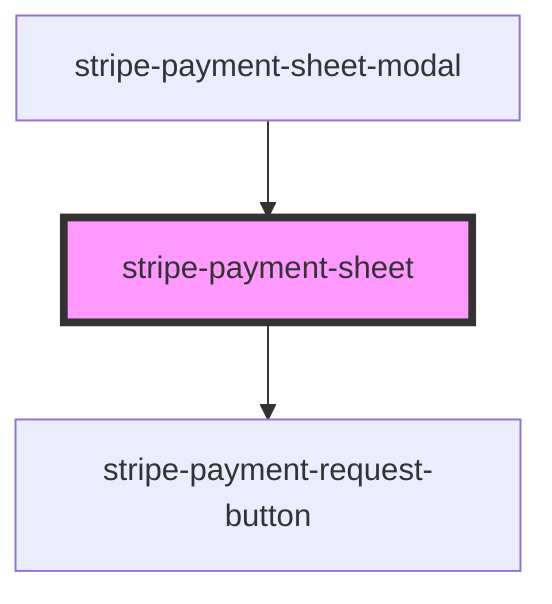

# stripe-payment-sheet

<!-- Auto Generated Below -->

## Properties

| Property                           | Attribute                               | Description                                                                                                                                                                                 | Type                                                      | Default     |
| ---------------------------------- | --------------------------------------- | ------------------------------------------------------------------------------------------------------------------------------------------------------------------------------------------- | --------------------------------------------------------- | ----------- |
| `handleSubmit`                     | --                                      | Form submit event handler                                                                                                                                                                   | `(event: Event, props: FormSubmitEvent) => Promise<void>` | `undefined` |
| `intentClientSecret`               | `intent-client-secret`                  | The client secret from paymentIntent.create response                                                                                                                                        | `string`                                                  | `undefined` |
| `intentType`                       | `intent-type`                           | Default submit handle type. If you want to use `setupIntent`, should update this attribute.                                                                                                 | `"payment" \| "setup"`                                    | `'payment'` |
| `publishableKey`                   | `publishable-key`                       | Your Stripe publishable API key.                                                                                                                                                            | `string`                                                  | `undefined` |
| `shouldUseDefaultFormSubmitAction` | `should-use-default-form-submit-action` | The component will provide a function to call the `stripe.confirmCardPayment`API. If you want to customize the behavior, should set false. And listen the 'formSubmit' event on the element | `boolean`                                                 | `true`      |
| `showLabel`                        | `show-label`                            | Show the form label                                                                                                                                                                         | `boolean`                                                 | `false`     |
| `showPaymentRequestButton`         | `show-payment-request-button`           |                                                                                                                                                                                             | `boolean`                                                 | `undefined` |
| `stripeDidLoaded`                  | --                                      | Stripe.js class loaded handler                                                                                                                                                              | `(event: StripeLoadedEvent) => Promise<void>`             | `undefined` |

## Events

| Event                     | Description                                   | Type                                                                                                                                                                                                                                       |
| ------------------------- | --------------------------------------------- | ------------------------------------------------------------------------------------------------------------------------------------------------------------------------------------------------------------------------------------------ |
| `defaultFormSubmitResult` | Recieve the result of defaultFormSubmit event | `CustomEvent<Error \| { paymentIntent: PaymentIntent; error?: undefined; } \| { paymentIntent?: undefined; error: StripeError; } \| { setupIntent: SetupIntent; error?: undefined; } \| { setupIntent?: undefined; error: StripeError; }>` |
| `formSubmit`              | Form submit event                             | `CustomEvent<{ stripe: Stripe; cardNumber: StripeCardNumberElement; cardExpiry: StripeCardExpiryElement; cardCVC: StripeCardCvcElement; intentClientSecret?: string; }>`                                                                   |
| `stripeLoaded`            | Stripe Client loaded event                    | `CustomEvent<{ stripe: Stripe; }>`                                                                                                                                                                                                         |

## Methods

### `initStripe(publishableKey: string) => Promise<void>`

Get Stripe.js, and initialize elements

#### Returns

Type: `Promise<void>`

### `setErrorMessage(errorMessage: string) => Promise<this>`

Set error message

#### Returns

Type: `Promise<this>`

### `setPaymentRequestOption(option: PaymentRequestButtonOption) => Promise<this>`

#### Returns

Type: `Promise<this>`

### `updateProgress(progress: ProgressStatus) => Promise<this>`

Update the form submit progress

#### Returns

Type: `Promise<this>`

## Dependencies

### Used by

 - [stripe-payment-sheet-modal](../stripe-payment-sheet-modal)

### Depends on

- [stripe-payment-request-button](../stripe-payment-request-button)

### Graph

----------------------------------------------

*Built with [StencilJS](https://stenciljs.com/)*
